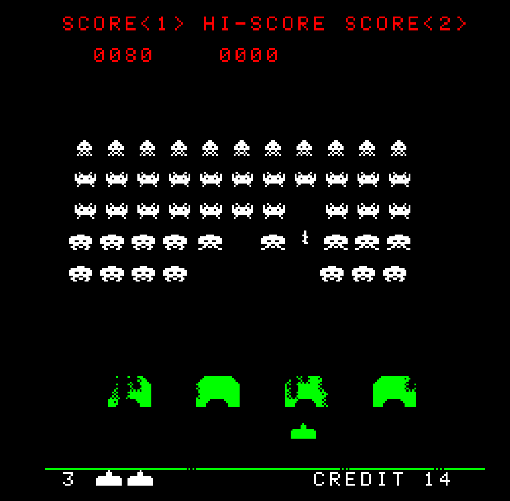

# Intel 8080 Space Invaders Emulator

A cycle-accurate Intel 8080 CPU emulator running the classic Space Invaders arcade game from 1978.

## Motivation

Built as an educational project to understand low-level CPU emulation, retro gaming hardware, and cross-platform development. This emulator accurately recreates the original arcade experience while demonstrating clean separation between emulation, machine, and platform layers.

## Build Status


## Screenshots




## Tech/Framework Used

**Built with:**
- C11
- SDL2 (graphics and input)
- CMake (build system)

## Features

- **Cycle-accurate 8080 emulation** - Runs at authentic 2MHz clock speed
- **Original arcade color overlay** - Red, white, and green screen zones
- **Cross-platform** - Windows and Linux support via SDL2
- **Configurable input** - Customize controls through input.cfg
- **Developer tools** - Disassembler, hex dump, and CPU diagnostic test
- **Clean architecture** - Three-layer design (emulator/machine/platform)

## Installation

Download pre-built binaries from [Releases](../../releases).

**Windows:**
1. Extract `i8080-spaceinvaders-windows-x64.zip`
2. Double-click `spaceinvaders.exe`

**Linux:**
1. Extract `i8080-spaceinvaders-linux-x64.tar.gz`
2. Run `./spaceinvaders`

## Building from Source

**Prerequisites:**
- CMake 3.10+
- C compiler (MSVC, GCC, or Clang)
- Git

**Build steps:**
```bash
git clone https://github.com/yourusername/i8080-spaceinvaders-emulator.git
cd i8080-spaceinvaders-emulator
git submodule update --init --recursive
cmake -B build -DCMAKE_BUILD_TYPE=Release
cmake --build build --config Release
```

**Run:**
```bash
./build/Release/spaceinvaders          # Windows
./build/spaceinvaders                   # Linux
```

## How to Use

**Running the game:**

Just double-click the executable or run from command line:
```bash
spaceinvaders              # Launch game directly
spaceinvaders run          # Same as above
```

**Default controls:**
- **Arrow Keys** - Move left/right
- **Space** - Shoot
- **C** - Insert coin
- **1** - Start (Player 1)
- **2** - Start (Player 2)

**Configure controls:**

Edit `input.cfg` to customize keyboard mappings:
```ini
P1_LEFT=LEFT
P1_RIGHT=RIGHT
P1_SHOOT=SPACE
P1_START=1
COIN=C
```

**Developer commands:**
```bash
spaceinvaders test                    # Run CPU diagnostic test
spaceinvaders dump output.txt         # Hex dump ROM
spaceinvaders disasm output.txt       # Disassemble ROM
```

## Credits

**References:**
- [Emulator101](http://www.emulator101.com/) - Excellent 8080 emulation tutorial
- [Computer Archeology](https://computerarcheology.com/Arcade/SpaceInvaders/) - Space Invaders hardware documentation
- [Superzazu's 8080 emulator](https://github.com/superzazu/8080) - Reference implementation

## License

GPL v3.0

This project is for educational purposes. Space Invaders is © Taito Corporation.